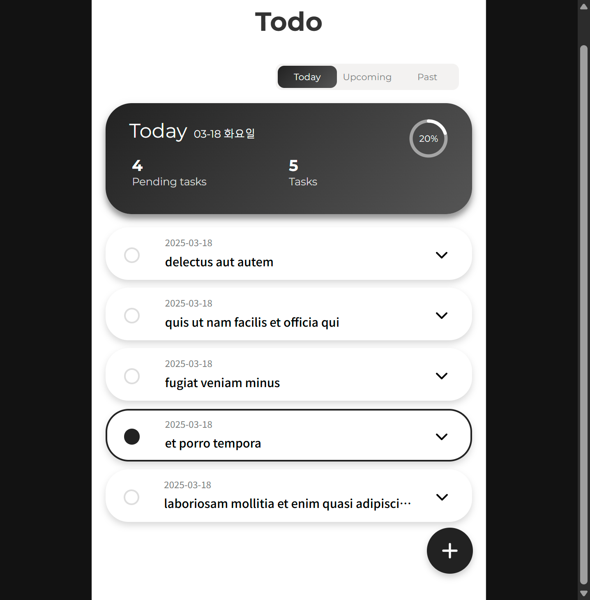
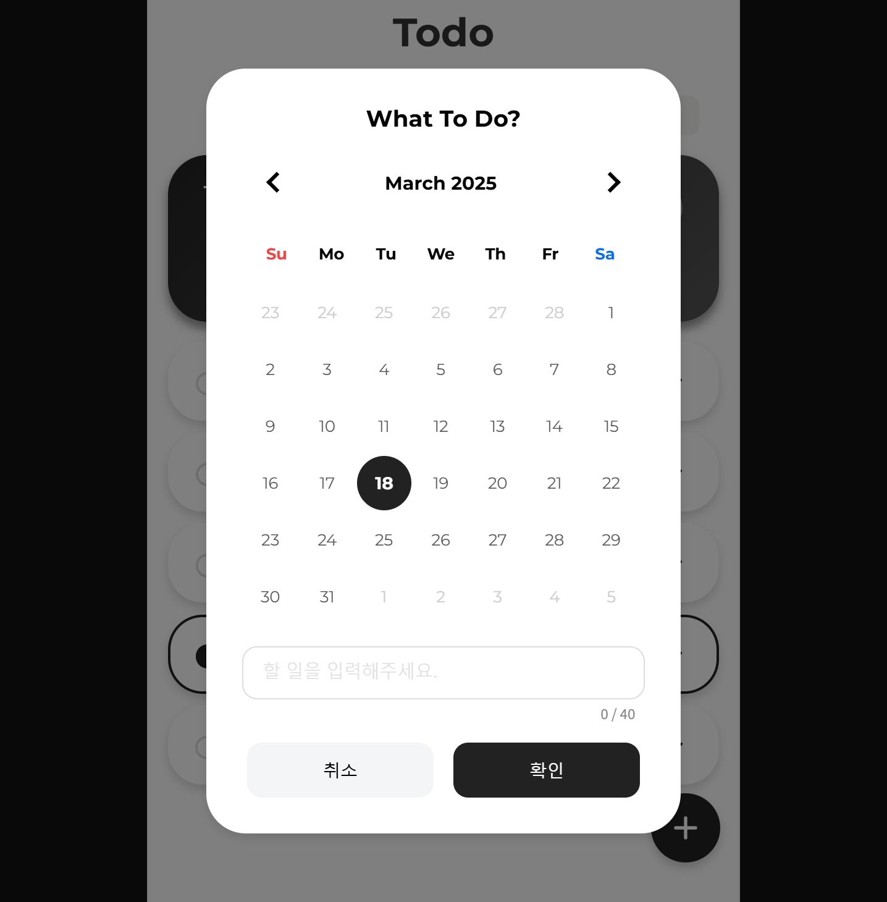
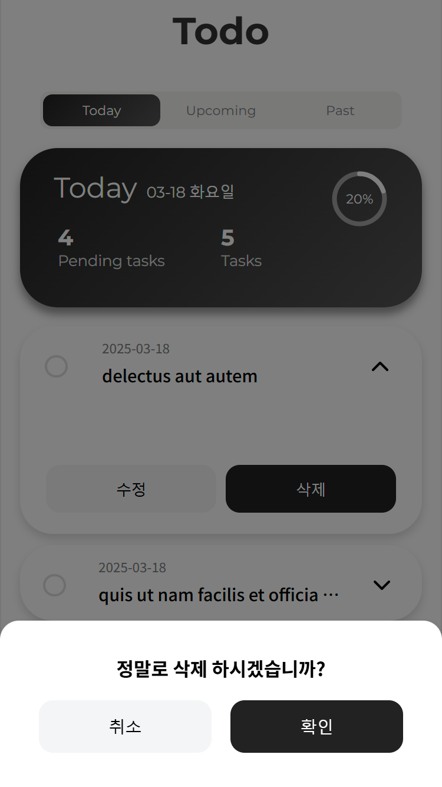
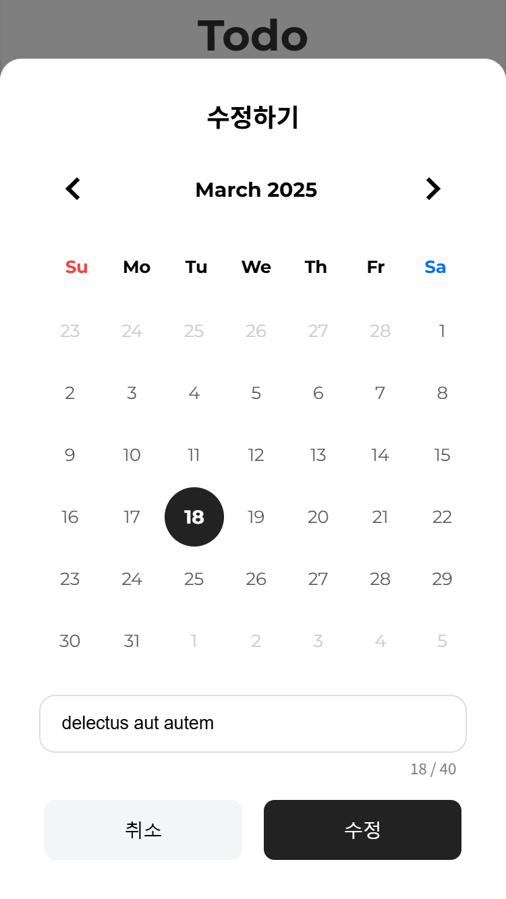

# 마인즈에이아이 프론트엔드 과제 테스트


To-Do 리스트 페이지 구현

## 목차

- [기술스텍](#기술스텍)
- [install](#install)
- [run](#run)
- [구조](#구조)
- [기능](#기능)
- [기능구현](#기능구현)
- [레이아웃](#레이아웃)

## 기술스텍

- 프레임워크: Next.js <br/>
- 언어: TypeScript <br/>
- CSS: SCSS,Styled Components <br/>
- UI: React Datepicker <br/>
- 유틸리티: Day.js <br/>

## isntall

```bash
npm install
```

## run

```bash
npm run dev
```

## 구조
```
mindeai-frontend-donghyunwi/
├── public/                             # 정적 파일
│   └── assets/
├── src/
│   └── app/                  
│       ├── favicon.ico
│       ├── globals.css
│       ├── layout.tsx
│       ├── components/           
│       │   ├── common/                 # 재사용 가능한 UI 컴포넌트
│       │   │   ├── date-picker/
│       │   │   └── floating-button/
│       │   └── modals/
│       │       ├── common/             # 재사용 가능한 modal
│       │       │   └── confrim-modal/
│       │       └── todo-list-modal
│       │           ├── add-task-modal/
│       │           └── edit-task-modal/
│       │   
│       └── (main)
│           ├── components/             # main page components
│           |   ├── sorted-list/            
│           |   ├── today-stasts/
│           |   ├── TodoList.styles.tsx
│           |   └── TodoList.tsx
│           └── page.tsx                # main page
├── next.config.js                     
├── tsconfig.json                      
└── package.json         
```

## 기능

- **✅ 외부 API에서 초기 To-Do 리스트 데이터를 가져오는 기능**
- **✅ 할 일을 추가하는 기능**
- **✅ 할 일을 완료 처리하는 기능**
- **✅ 할 일을 삭제하는 기능**
- **✅ 로컬 스토리지를 사용하여 데이터를 저장하고 앱이 다시 로드될 때 데이터를 불러오는 기능**
<br/><br/>
- **➕ 할 일의 일정 설정하는 기능**
- **➕ 할 일의 일정과 할 일을 수정하는 기능**

## 기능구현

- **할 일 추가**: 플로팅 버튼을 누르고 모달에서 새로운 할 일과 일정을 추가한 후 확인 버튼을 클릭합니다.
- **할 일 완료**: 할 일 목록에서 해당 할 일의 체크박스를 클릭합니다.
- **할 일 삭제**: 할 일 목록에서 할 일을 클릭한 후 삭제 버튼을 클릭하고, 모달에서 확인 버튼을 클릭합니다.
<br/><br/>
- **➕ 할 일 수정**: 할 일 목록에서 할 일을 클릭한 후 수정 버튼을 클릭하고, 모달에서 할 일과 일정을 수정한 후 확인 버튼을 클릭합니다.

## 레이아웃

### web



### mobile

